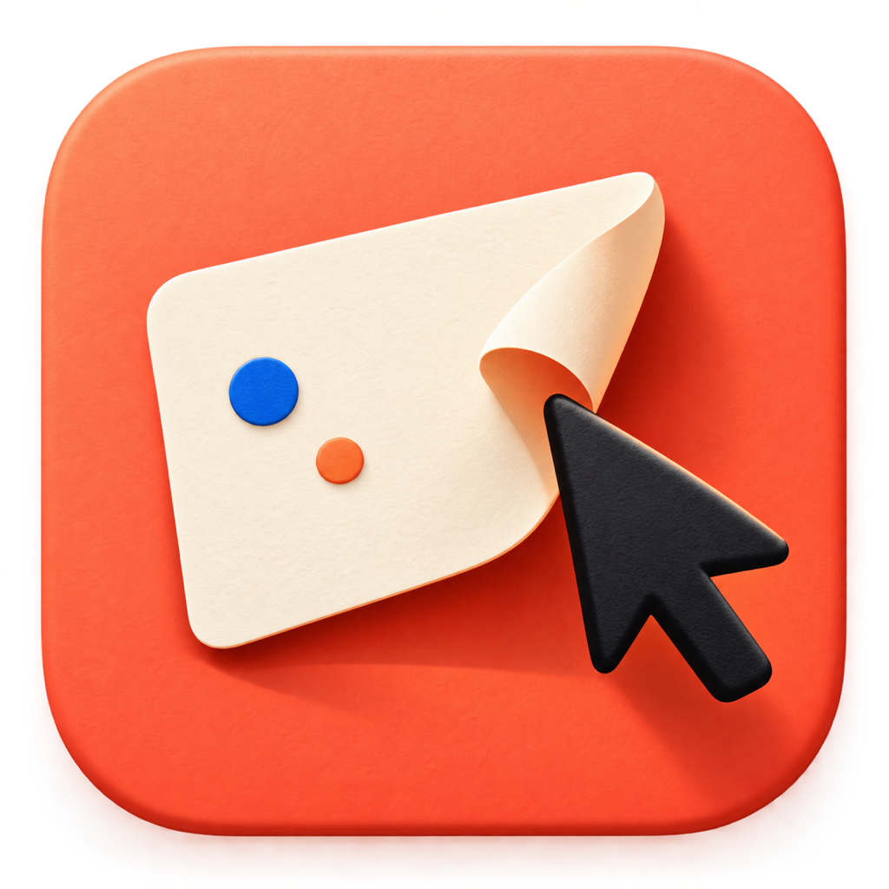

# ShotDesk

[Chinese documentation](README.zh-CN.md)



ShotDesk is a native macOS menu bar app for fast screenshot capture, annotation, and clipboard-first sharing. It supports free-form selection on multiple displays and one-key capture of configured application windows.

Key features:

- Per-display capture overlays that work across mixed Retina and non-Retina setups.
- Rectangle, arrow, and text annotations before copying an image to the clipboard.
- Configurable application targets, including optional browser-tab activation and content cropping.
- Clipboard-first output; saving PNG files is opt-in.

For detailed Chinese setup, shortcuts, configuration, and design notes, see the [Chinese documentation](README.zh-CN.md).

## Build and install

```bash
./build.sh
open build/ShotDesk.app
```

The camera icon in the menu bar indicates a successful launch. ShotDesk intentionally has no Dock icon.

To install or update the copy in `~/Applications`, run:

```bash
./build.sh --install
```

Plain `./build.sh` only creates `build/ShotDesk.app`; it never overwrites an installed copy.

Run automated tests:

```bash
swift test -j 1
```

### App Icon

The icon represents lifting a piece of content from the desktop. Its source is `Resources/AppIcon.png`; `build.sh` regenerates the required sizes and packages them as `Resources/AppIcon.icns` when the source changes.

To regenerate only the icon resources:

```bash
swift tools/MakeIcon.swift Resources/AppIcon.png build/AppIcon.iconset
iconutil -c icns build/AppIcon.iconset -o Resources/AppIcon.icns
```
